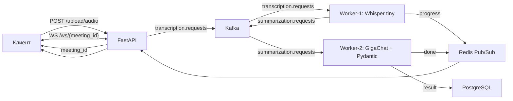

# 🤖 Meeting Assistant

Production-ready сервис для **автоматической транскрипции и суммаризации встреч** с извлечением action items. Асинхронная обработка через **Apache Kafka**, real-time обновления клиенту через **WebSocket**, саммари и задачи формирует **LLM GigaChat** в режиме **agentic pipeline с function calling**.

---

## ✨ Возможности

- 🎙️ Загрузка аудио → автоматическая транскрипция **Whisper (faster-whisper, tiny)**
- 📝 Структурированное саммари + ключевые пункты + **action items** от **GigaChat**
- 🧠 **Function Calling / агентный цикл**: GigaChat сам решает вызывать инструменты
  - `send_telegram_alert` — уведомление о завершении встречи
  - `get_meeting_stats` — статистика встреч из PostgreSQL
  - `create_calendar_event` — создание события по action item
- ⚡ Real-time прогресс и результат через **WebSocket**
- 🗄️ История встреч в **PostgreSQL**
- 🐳 Оркестрация **7 контейнеров** через Docker Compose

---

## 🏗 Архитектура



**Поток данных:**

1. Клиент загружает аудио → `POST /upload/audio`.
2. FastAPI сохраняет файл, создаёт запись в БД (`status=pending`) и публикует в Kafka-топик `transcription.requests`.
3. **Worker-1 (Whisper)** транскрибирует, обновляет статус (`summarizing`) и отправляет текст в `summarization.requests`.
4. **Worker-2 (GigaChat)** в **агентном цикле** анализирует текст, при необходимости вызывает инструменты и возвращает `MeetingSummary` (JSON).
5. Результат сохраняется в PostgreSQL и публикуется в Redis Pub/Sub на канал `meeting:{id}`.
6. FastAPI WebSocket пересылает клиенту прогресс и итоговый отчёт в реальном времени.

---

## 🛠 Технологический стек

| Технология | Назначение |
|---|---|
| Python 3.12 | Основной язык |
| FastAPI + Uvicorn | Веб-фреймворк и ASGI-сервер |
| Apache Kafka 7.5.0 | Брокер сообщений (2 топика, 2 воркера) |
| Zookeeper 7.5.0 | Координатор Kafka |
| PostgreSQL 15 | Хранение истории встреч |
| Redis 7 | Pub/Sub для real-time уведомлений |
| faster-whisper (tiny) | Транскрипция аудио |
| GigaChat (SDK 0.2.3) | LLM для суммаризации + function calling |
| Pydantic v2 | Structured Output (валидация JSON от LLM) |
| Docker Compose | Оркестрация 7 контейнеров |

---

## 📁 Структура проекта

```
meeting_assistant/
├── app/
│   ├── database.py        # SQLAlchemy: модель Meeting + CRUD
│   ├── main.py            # FastAPI: upload, status, WebSocket
│   ├── models.py          # Pydantic: ActionItem, MeetingSummary
│   └── redis_client.py    # Async + sync Redis клиенты
├── worker_transcribe/
│   └── consumer.py        # Whisper tiny + Kafka Consumer
├── worker_summarize/
│   ├── consumer.py        # GigaChat + агентный цикл function calling
│   ├── tools.py           # Инструменты: telegram, stats, calendar
│   └── demo_tools.py      # Демо-скрипт агентного цикла
├── uploads/               # Аудиофайлы (volume)
├── .env                   # GIGACHAT_CREDENTIALS
├── Dockerfile             # Общий образ (api + worker_transcribe)
├── Dockerfile.summarize   # Лёгкий образ worker_summarize (без ffmpeg/Whisper)
├── requirements.txt       # Зависимости api + transcribe
├── requirements-summarize.txt  # Зависимости только для sumarize
├── docker-compose.yaml    # 7 сервисов
└── test_ws.py             # End-to-end тест WebSocket
```

> **Почему два Dockerfile?** Воркеру суммаризации не нужны `ffmpeg` и `faster-whisper` (это тяжёлый слой на 10–15 минут сборки). Лёгкий `Dockerfile.summarize` собирается за ~40 секунд.

---

## 🚀 Быстрый старт

### 1. Предварительные требования
- Docker Desktop (с включённым **WSL2** — иначе ошибка `virtualization not detected`)
- Креденшиалы GigaChat от [SberCloud](https://developers.sber.ru/gigachat)

### 2. Настройка `.env`
Создайте файл `.env` в корне проекта:

```env
# Base64-кодированный JWT из личного кабинета GigaChat
GIGACHAT_CREDENTIALS=<ваш_base64_токен>

# (опционально) Модель GigaChat. Доступные: GigaChat-2, GigaChat-2-Pro,
# GigaChat-2-Max, GigaChat-3-Lightning, GigaChat-3-Pro, GigaChat-3-Ultra
GIGACHAT_MODEL=GigaChat-3-Ultra
```

### 3. Запуск
```bash
# Запуск всего стека (первая сборка — долгая из-за ffmpeg/Whisper)
docker compose up -d --build

# Проверка состояния всех сервисов
docker compose ps
```

---

## 🔌 API

### `POST /upload/audio`
Загружает аудиофайл и возвращает `meeting_id`.

```bash
curl -X POST http://localhost:8011/upload/audio \
  -F "file=@встреча.mp3"
```
```json
{ "meeting_id": "uuid", "status": "pending", "message": "Аудио принято в обработку..." }
```

### `GET /meetings/{meeting_id}`
Возвращает текущий статус и данные встречи.

```bash
curl http://localhost:8011/meetings/{meeting_id}
```

### `WS /ws/{meeting_id}` — real-time уведомления
```bash
websocat ws://localhost:8011/ws/{meeting_id}
```

---

## 🧠 Function Calling (агентный цикл)

В [`worker_summarize/consumer.py`](worker_summarize/consumer.py) реализован agentic-цикл: модель получает список функций, может вызывать их, получать результат и продолжать рассуждение до формирования финального JSON.

```python
while True:
    response = giga_client.chat(Chat(model=..., messages=messages, functions=functions, function_call="auto"))
    msg = response.choices[0].message
    if msg.function_call:
        result = execute_tool(msg.function_call.name, parse(msg.function_call.arguments))
        messages.append(Messages(role="function", name=name, content=json.dumps(result)))
        continue
    break  # финальный ответ
```

**Инструменты** описаны в [`worker_summarize/tools.py`](worker_summarize/tools.py):

| Инструмент | Тип | Описание |
|---|---|---|
| `send_telegram_alert(meeting_id, message)` | симуляция | Уведомление в Telegram |
| `get_meeting_stats(period)` | реальный запрос к БД | Статистика встреч за day/week/month |
| `create_calendar_event(task, deadline)` | симуляция | Событие календаря по action item |

> Симуляции (`telegram`, `calendar`) логируют результат и готовы к замене на реальные внешние API. `get_meeting_stats` делает настоящий запрос к PostgreSQL.

### Демонстрация агентного цикла
```bash
docker exec worker_summarize python -u -m worker_summarize.demo_tools
```

---

## 🧪 Тестирование

```bash
# End-to-end тест: загрузка аудио + прослушивание WebSocket
python test_ws.py test_audio.mp3
```

Ожидаемый вывод (последовательность сообщений WS):
```json
{"status": "transcribing", "progress": 0}
{"status": "summarizing", "progress": 50}
{"status": "summarizing", "progress": 70}
{"status": "done", "summary": "...", "key_points": [...], "action_items": [...]}
```

---

## ⚙️ Полезные команды

```bash
# Пересборка одного сервиса
docker compose build --progress=plain worker_summarize

# Логи контейнера
docker logs worker_summarize
docker logs meeting_api
docker logs worker_transcribe

# Войти в БД
docker exec -it meeting_assistant-db-1 psql -U user -d meetings

# Войти в Redis
docker exec -it meeting_assistant-redis-1 redis-cli

# Список топиков Kafka
docker exec meeting_assistant-kafka-1 kafka-topics --bootstrap-server kafka:29092 --list
```

---

## 🐛 Устранение проблем

| Ошибка | Причина | Решение |
|---|---|---|
| `virtualization not detected` | Не включён WSL2 | Включить VirtualMachinePlatform + WSL, перезагрузиться |
| `ModuleNotFoundError: No module named 'app'` | Неверные импорты | Использовать `from app.database import ...` |
| `UNKNOWN_TOPIC_OR_PART` | Топик не создан | `AdminClient.create_topics()` в воркере |
| Долгая сборка (`Get:330...`) | `ffmpeg` тянет 300 зависимостей | Не зависло — ждать 5–10 мин или использовать `Dockerfile.summarize` |
| `404 No such model` | Устаревшее имя модели | Задать актуальное в `GIGACHAT_MODEL` (см. `.env`) |
| Кракозябры в терминале Windows | Кодировка консоли `cp866` | Это косметика; данные JSON корректны (UTF-8) |

---

## 🗺 Роадмап

- [x] Транскрипция (Whisper) + суммаризация (GigaChat)
- [x] Real-time WebSocket + Redis Pub/Sub
- [x] Function Calling / агентный цикл
- [ ] README + публикация на GitHub
- [ ] Fine-tuning Whisper под русскую речь
- [ ] Prometheus + Grafana мониторинг
- [ ] Celery + Redis как альтернатива Kafka
- [ ] Раздельная сборка образов для API и воркеров

---

## 📄 Лицензия

Проект создан в учебно-демонстрационных целях для портфолио.